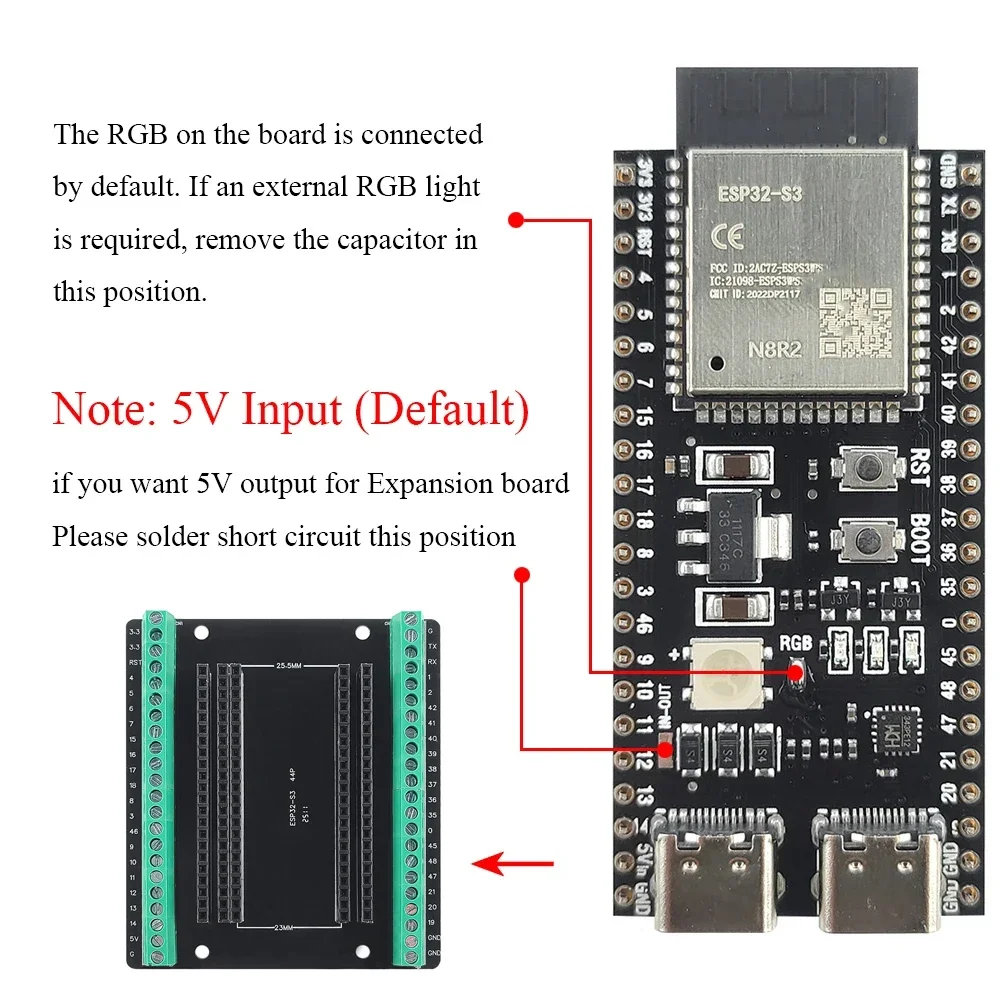
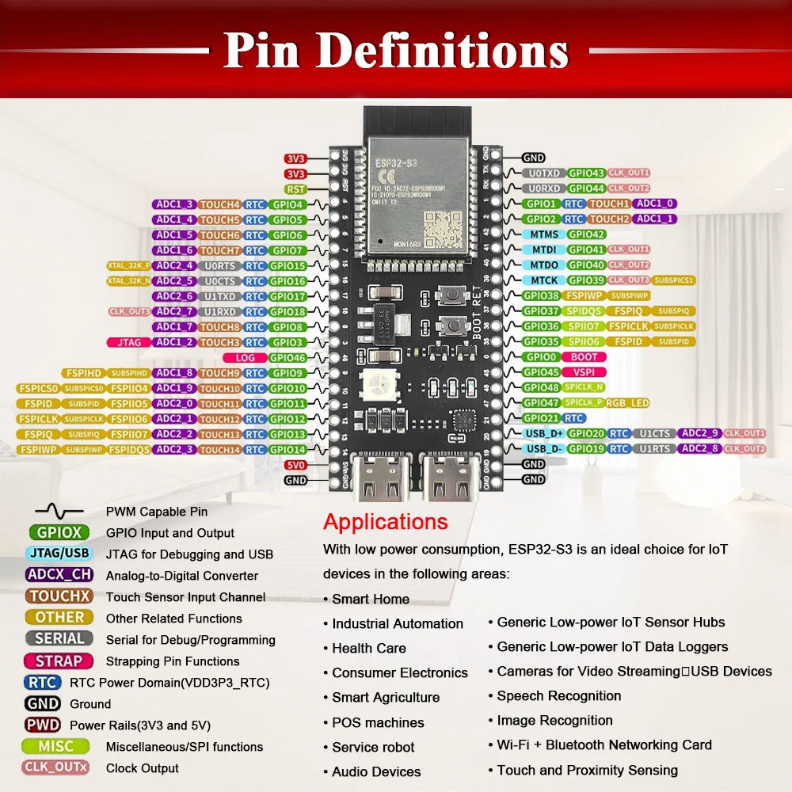

# esp32-s3-ex1

ESP32-S3-N8R2 / N16R8 (44핀 USB-C DevKit, 8MB PSRAM) + TinyGo 예제 프로젝트. 현재 동작 모드: 온보드 RGB LED blink.

## Board Overview



- 모듈: **ESP32-S3-N8R2** (8MB flash + 2MB PSRAM) 또는 **N16R8** (16MB flash + 8MB PSRAM)
- 44핀 DIP 헤더 (양쪽 22핀)
- USB-C 두 개 — 좌측은 USB-to-UART 브리지, 우측은 ESP32-S3 네이티브 USB(USB-Serial/JTAG)
- BOOT / RST 푸시버튼
- 내장 **WS2812 RGB LED** (GPIO48, 보드 다이어그램의 "RGB" 표시)
- 5V 핀 방향은 솔더 점퍼로 전환 (기본은 5V 입력; 확장보드 급전이 필요하면 점퍼 단락)

## Board PIN Definitions



TinyGo 빌드 타겟은 `esp32s3-generic`. 이 타겟에는 `D0`, `LED` 같은 별칭이 정의돼 있지 않으니 코드에서는 항상 `machine.GPIO<N>` 으로 직접 참조한다.

### 좌측 헤더 (모듈 안테나 기준 위→아래)

| 라벨 | GPIO | 비고 |
|------|------|------|
| 3V3  | —    | 3.3V 출력 |
| 3V3  | —    | 3.3V 출력 |
| RST  | —    | 외부 리셋 입력 (active low) |
| 4    | GPIO4  | ADC, Touch |
| 5    | GPIO5  | ADC, Touch |
| 6    | GPIO6  | ADC, Touch |
| 7    | GPIO7  | ADC, Touch |
| 15   | GPIO15 | ADC |
| 16   | GPIO16 | ADC |
| 17   | GPIO17 | ADC |
| 18   | GPIO18 | ADC |
| 8    | GPIO8  | ADC, Touch |
| 3    | GPIO3  | ADC, Touch, 스트래핑 |
| 46   | GPIO46 | 스트래핑 |
| 9    | GPIO9  | ADC, Touch |
| 10   | GPIO10 | ADC, Touch |
| 11   | GPIO11 | ADC, Touch |
| 12   | GPIO12 | ADC, Touch |
| 13   | GPIO13 | ADC, Touch |
| 14   | GPIO14 | ADC, Touch |
| 5V   | —    | USB 5V (기본: 입력) |
| GND  | —    | |

### 우측 헤더 (모듈 안테나 기준 위→아래)

| 라벨 | GPIO | 비고 |
|------|------|------|
| GND  | —    | |
| TX   | GPIO43 | UART0 TX (기본 콘솔) |
| RX   | GPIO44 | UART0 RX (기본 콘솔) |
| 1    | GPIO1  | ADC, Touch |
| 2    | GPIO2  | ADC, Touch |
| 42   | GPIO42 | JTAG TMS |
| 41   | GPIO41 | JTAG TDI |
| 40   | GPIO40 | JTAG TDO |
| 39   | GPIO39 | JTAG TCK |
| 38   | GPIO38 | |
| 37   | GPIO37 | N16R8 모듈에서 옥탈 PSRAM에 점유 — 사용 금지 |
| 36   | GPIO36 | N16R8 모듈에서 옥탈 PSRAM에 점유 — 사용 금지 |
| 35   | GPIO35 | N16R8 모듈에서 옥탈 PSRAM에 점유 — 사용 금지 |
| 0    | GPIO0  | BOOT 스트래핑 (low 시 부트로더 진입) |
| 45   | GPIO45 | 스트래핑 |
| 48   | GPIO48 | **WS2812 RGB LED** (보드 내장) |
| 47   | GPIO47 | |
| 21   | GPIO21 | |
| 20   | GPIO20 | USB D+ (네이티브 USB 사용 시 GPIO로 쓰면 안 됨) |
| 19   | GPIO19 | USB D- (네이티브 USB 사용 시 GPIO로 쓰면 안 됨) |
| GND  | —    | |
| GND  | —    | |

### 사용 주의

- **GPIO19 / GPIO20** — ESP32-S3 네이티브 USB D-/D+. 우측 USB-C로 플래시/모니터 시 일반 GPIO로 사용 불가.
- **GPIO35 / 36 / 37** — N16R8(옥탈 PSRAM) 모듈은 내부 PSRAM 버스에 연결. N8R2(쿼드 PSRAM)는 사용 가능. 모듈 표기 확인 필수.
- **GPIO0** — 부트 스트래핑. 부팅 시 풀-다운하면 ROM 부트로더로 진입. 일반 입력으로 사용 가능하나 부팅 직후 저항/외부 입력에 주의.
- **GPIO48** — 보드 내장 WS2812 RGB LED. 단순 digital toggle로는 동작하지 않으며 WS2812 프로토콜이 필요.

### DHT22 권장 결선

| DHT22 핀 | 헤더 라벨 | GPIO |
|----------|-----------|------|
| VCC  | 3V3 | — |
| DATA | 4   | GPIO4 |
| GND  | GND | — |

> DATA 라인에는 VCC와의 사이에 4.7k–10kΩ pull-up 저항 권장.

## Build / Flash / Monitor

전제: TinyGo ≥ 0.41, `espflasher` 설치 (`go install tinygo.org/x/espflasher@latest`).

```bash
make build                                       # build/firmware.bin 생성
make flash PORT=/dev/cu.usbmodemXXXX             # espflasher로 적재
make monitor PORT=/dev/cu.usbmodemXXXX           # 시리얼 모니터
```

기본 빌드 타겟은 `esp32s3-generic`. 다른 보드면 `make build TARGET=...` 으로 재정의.

DHT22 + WiFi 버전(`main.go.backup`)을 사용하려면:

```bash
cp main.go.backup main.go
make flash PORT=/dev/cu.usbmodemXXXX \
  SSID=YOUR_SSID PASSWORD=YOUR_PW \
  SERVER_URL=http://192.168.0.10:8080/sensor
```

기본 `main.go` 는 WS2812 팔레트 사이클과 1.69" 240x280 ST7789V3 콘솔
출력을 함께 동작시킨다. `println` 으로 찍는 로그가 USB 시리얼과 ST7789
화면 양쪽에 동시에 표시된다. 결선·API 는 [docs/st7789-console.md](docs/st7789-console.md)
참고.

새 페리페럴에 GPIO 를 할당하기 전에는 [docs/gpio-pin-mapping.md](docs/gpio-pin-mapping.md)
의 금지 핀 / 안전 핀 목록과 매핑 절차를 먼저 확인한다.
