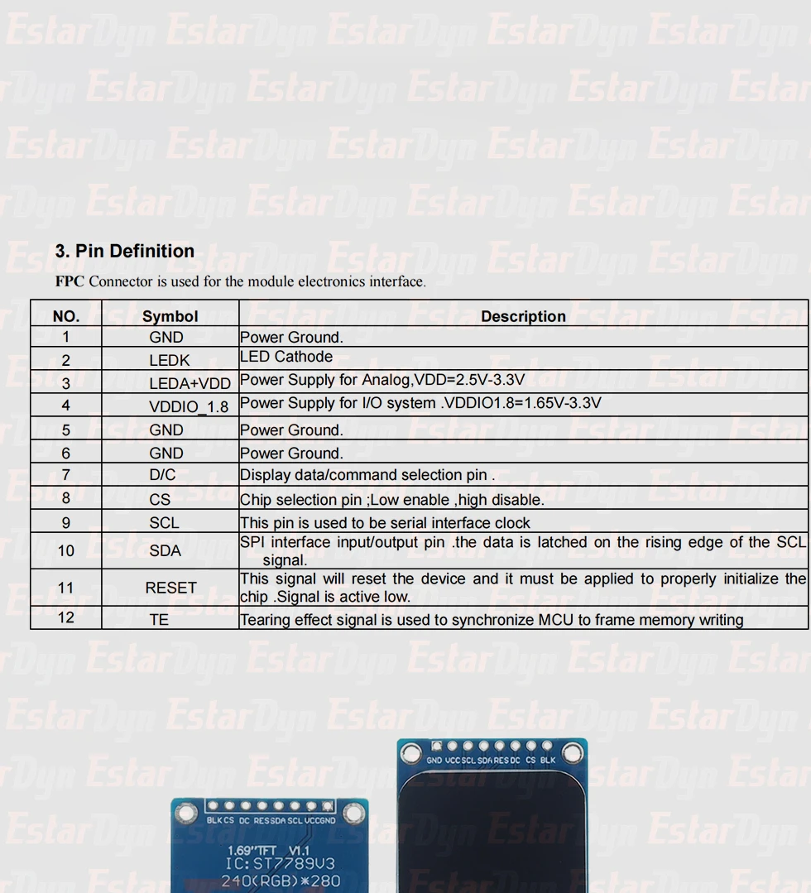

# ST7789V3 텍스트 콘솔

`internal/console` 패키지는 ST7789V3 패널 위에 터미널처럼 동작하는 텍스트
영역을 제공한다. 새 줄은 화면 위에서부터 채워지다가, 마지막 줄까지 가득
차면 하드웨어 수직 스크롤(VSCRDEF / VSCRSADD)을 이용해 한 줄씩 위로 밀려
올라간다. 매 줄마다 SPI 로 전송되는 픽셀은 글자 한 줄 분량 + 스크롤
어드레스 2 바이트가 전부라서 ESP32-S3 의 SPI 대역폭을 거의 사용하지
않는다.

## 빠른 사용

```go
import (
    "image/color"
    "machine"

    "esp32-s3-ex1/internal/console"
    "tinygo.org/x/drivers/st7789"
    "tinygo.org/x/tinyfont/freemono"
)

bus := machine.SPI0 // ESP32-S3 FSPI = 하드웨어 SPI2
bus.Configure(machine.SPIConfig{Frequency: 40_000_000, SCK: machine.GPIO12, SDO: machine.GPIO11})

disp := st7789.New(bus, machine.GPIO8, machine.GPIO10, machine.GPIO9, machine.GPIO7)
// 드라이버에는 **컨트롤러 GRAM 의 전체 크기(240x320)** 만 알려준다.
// 패널 rowstart 는 console.Config 에 넣는다 — Rotation0 에서는 드라이버가
// rowstart 를 무시하기 때문에 콘솔이 직접 보정한다.
disp.Configure(st7789.Config{Width: 240, Height: 320})

term := console.New(&disp, &freemono.Regular9pt7b, console.Config{
    Width:      240,
    Height:     280, // 패널의 가시 영역
    RowOffset:  20,  // GRAM 안에서 패널이 시작하는 행
    LineHeight: 15, Baseline: 11, CharAdvance: 11,
    Foreground: color.RGBA{220, 220, 220, 255},
    Background: color.RGBA{0, 0, 0, 255},
})
term.Init()

term.Println("ready.")
for i := 0; i < 100; i++ {
    term.Println("line " + strconv.Itoa(i))
}
```

전체 데모는 루트 `main.go` 에 통합돼 있다 (`say()` 헬퍼로 USB 시리얼
`println` 과 ST7789 콘솔 양쪽에 동시에 출력). 다음과 같이 빌드 / 플래시한다.

```bash
make build                                # build/firmware.bin 생성
make flash   PORT=/dev/cu.usbmodemXXXX
make monitor PORT=/dev/cu.usbmodemXXXX
```

## 결선 (기본 핀)

대상 모듈은 ST7789V3 컨트롤러를 쓰는 1.69" 240x280 TFT 보드다. 브레이크
아웃 PCB 의 핀 라벨은 보통 `BLK CS DC RES SDA SCL VCC GND` (또는 반대
배열) 이며, 컨트롤러 데이터시트와 매핑하면 다음과 같다.



| 모듈 라벨 | 데이터시트 | ESP32-S3 GPIO | 비고 |
|-----------|------------|---------------|------|
| SCL       | SPI clock  | GPIO12        | TinyGo `SPIConfig.SCK` |
| SDA       | SPI MOSI   | GPIO11        | TinyGo `SPIConfig.SDO` (4선 SPI, MISO 미사용) |
| DC        | D/C        | GPIO10        | data / command 선택 |
| CS        | chip select| GPIO9         | active low |
| RES       | RESET      | GPIO8         | active low (초기화) |
| BLK       | LED cathode| GPIO7         | 백라이트 enable (PWM 가능) |
| VCC       | LEDA+VDD   | 3V3           | 2.5V–3.3V 권장. 5V 인가 금지 |
| GND       | GND        | GND           | 공통 그라운드 |

> 일부 보드에는 `TE` (tearing-effect) 핀이 노출돼 있지만 본 데모에서는
> 사용하지 않는다. VDDIO_1.8 라인은 모듈 PCB 내부에서 처리되며 외부
> 결선 불필요.

핀을 바꾸려면 루트 `main.go` 상단의 `pinSCK` / `pinMOSI` / `pinDC` /
`pinCS` / `pinRST` / `pinBL` 상수만 수정한다. N16R8 모듈은 GPIO35/36/37 이
옥탈 PSRAM 에 점유되므로 사용하지 않는다 — 자세한 안전 핀 목록은
[docs/gpio-pin-mapping.md](gpio-pin-mapping.md) 참고.

## 패널 변형

콘솔은 두 가지 좌표계를 분리해 다룬다.

1. **`st7789.Config`** — ST7789 컨트롤러의 GRAM 전체 크기 (거의 모든 변형에서
   `Width: 240, Height: 320`). RowOffset / ColumnOffset 은 넣지 않는다.
2. **`console.Config`** — 패널의 가시 영역 크기(`Width`, `Height`) 와 GRAM
   안에서 가시 영역이 시작하는 위치(`RowOffset`, `ColOffset`). 콘솔이 이
   값을 모든 `setWindow` 호출과 스크롤 어드레스에 직접 더해 쓰기 때문에,
   드라이버가 Rotation0 에서 rowstart 를 무시해도 어긋남이 생기지 않는다.

| 패널         | console Width | console Height | console RowOffset | console ColOffset | 비고 |
|--------------|---------------|----------------|-------------------|-------------------|------|
| 2.0" / 1.9"  | 240           | 320            | 0                 | 0                 | 가장 일반적 |
| 1.69"        | 240           | 280            | **20**            | 0                 | Waveshare 등 |
| 1.47"        | 172           | 320            | 0                 | **34**            | column 쪽 offset |
| 1.3"/1.54"   | 240           | 240            | 0 또는 80          | 0                 | 모듈 데이터시트 확인 |

> ℹ️ 이전 버전(`feature/st7789-text-console` 머지 직후)에는 패널 rowstart 가
> 드라이버에 전달되었는데, `tinygo.org/x/drivers/st7789` v0.35.0 은
> Rotation0 에서 `rowOffset = 0` 으로 강제하기 때문에 1.69" 패널에서 상단이
> 잘리고 하단이 비는 증상이 있었다. 현재 버전은 콘솔이 RowOffset 을 직접
> 보정해 이 문제를 우회한다.

## 폰트와 컬럼 수

`tinygo.org/x/tinyfont/freemono.Regular9pt7b` 는 11x15 px 모노스페이스다.
240x280 패널에서 21 열 × 18 행을 얻는다. 더 큰 폰트(`freemono.Regular12pt7b`
등)로 바꾸면 가독성은 좋아지지만 행/열 수가 줄어든다.

> tinyfont 의 FreeMono 계열은 ASCII (0x20~0x7E) 만 포함한다. 한글
> 출력이 필요하다면 별도의 한글 비트맵 폰트(예: `tinygo.org/x/tinyfont/notosans`
> 의 한글 서브셋이나 자체 글리프 테이블)를 추가해야 한다.

## 내부 동작 요약

- `Init` 단계에서 `SetScrollArea(RowOffset, 320 - RowOffset - rows*LineHeight)`
  를 호출해 GRAM 안에서 패널 가시 영역만 스크롤 영역(VSA) 으로 잡는다.
  예시 (1.69" 패널): `SetScrollArea(20, 30)` → 물리 VSA = GRAM rows 20..289,
  하단 10 px 는 BFA. GRAM 0..19 / 300..319 는 off-panel.
- 라인 카운터 `nextLn` 가 `rows` 미만이면 다음 줄을 GRAM 행 `RowOffset +
  ringPos * LineHeight` 에 그린다.
- `nextLn >= rows` 가 되면 그리기 전에 `SetScroll(RowOffset + topRing *
  LineHeight)` 을 먼저 호출해 화면을 한 줄 위로 밀어 올린다. 새 줄이
  화면 최하단에서 등장한다.
- 모든 `FillRectangle` / `tinyfont.WriteLine` 좌표에는 `ColOffset` /
  `RowOffset` 이 콘솔에서 직접 더해진다 — 드라이버의 Rotation0 이 패널
  오프셋을 무시해도 콘솔이 GRAM 절대 좌표로 통신하므로 어긋남이 없다.
- 줄 너비를 넘는 문자열은 자동으로 다음 줄로 줄바꿈된다.

## 한계

- 행 단위 스크롤이라 픽셀 단위(부드러운) 스크롤은 아니다.
- ASCII / 라틴 문자 위주. 한글·CJK 는 별도 폰트 필요.
- 현재 `Println` 만 색상 단일. 라인별 색상이 필요하면 `tinyfont.WriteLineColors`
  를 사용하도록 확장 가능.
